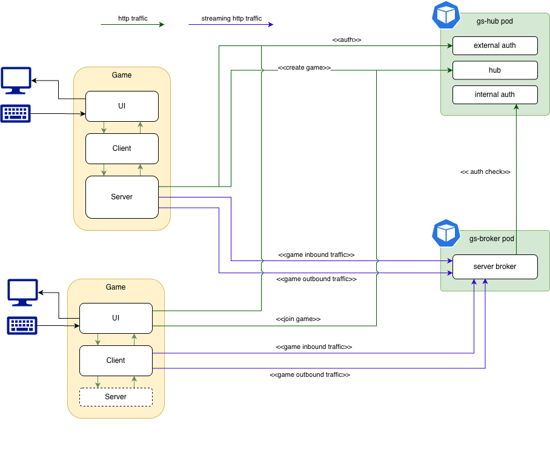
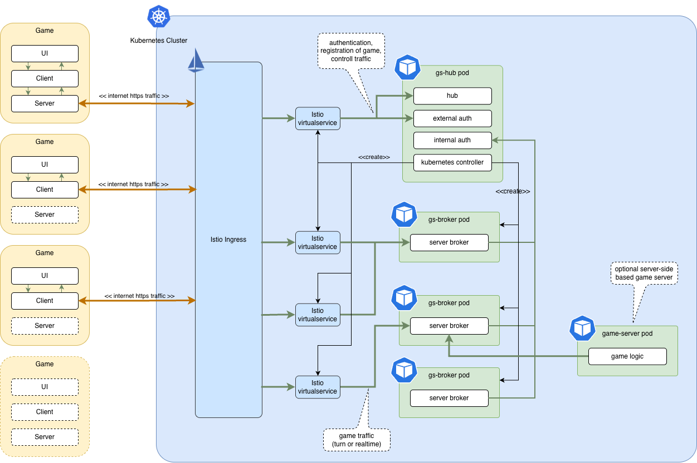

# Sigas Alpha Architecture

This section is describing architecture of Sigas Alpha game server.

## High Level Architecture

Main idea behind this server is to use HTTP(s) protocol wherever it is not possible to use TCP/UDP
as it is well-supported in environments where there are institution Proxies and Firewalls set.

Second principle is that server is try not to prejudice were game logic is set and allow 'games'
or 'rooms' to be implemented. For turn based games extra latency is not an issue so game logic can
exist on the client itself. For instance, client can create a 'game' or 'room' where other clients
are start sending updates through allocated broker. Traffic from the 'main' client that hosts
the game is local, but all other clients would receive game updates from main client, through
broker and send all user inputs back through the same route through broker back to the main client.
Multicasting is only happen at the broker level, while option for game server to send specific
messages to specific client still exists.

## Communication

Communication between game clients and game server's hub is done through ordinary HTTP(s) requests
with potentially long polls from client to the server in order for some notifications to be sent
the moment they arise on the server.

The game itself is split into client and server.

### Server

The game server is communicating with server broker using two separate HTTP(s) requests - one where
using chunked encoding will never end stream of sending data to the server and second which virtually
sends no data to the server but expect response to be chunked encoding being send back - a never ending
stream.

Packages on the each direction always has size and amount of data each packet consists on.

### Client

The client is responsible for sending user inputs to the game server and receiving updates from the server.
On the main game client  server is local and communication between client and server is going to happen in memory
on the same Python process (simple calls to methods and callbacks). For clients that do not host game,
client code is opening two HTTP(s) requests in exactly the same way as the server.

### Broker

The role of the broker is to accept all packets from all clients within one game and forward them to
the game server and to receive all packages from the server and, depending on flag in those messages, send
them to all clients or specific client(s) message is intended for.

## Client

Initial targeted platform for client is Python with Pygame, where this provides client library for:
- authentication with server
- server control operations (creation of room, accepting clients, etc)
- transmission and reciving of game packets
- game state machine

Python seems as the simplest language to quickly get up to speed, along with Pygame. Bonus is
that it is currently used in Kenilworth School's Game Creators Club which is one of the reasons
for this sever to be created. Aside of that, [GCC-online-games project](https://github.com/GamesCreatorsClub/GCC-games-online)
with allows simplified version of Python with Pygame to be interpreted inside of LibGDX GWT
backend in browser. One of the stretch goals of this project is to eventually provide implementation for it
with the same functionality as above-mentioned Python library.

## Server

Server side of the architecture targets Kubernetes cluster and tries to leverage its extensibility.]
Also, it relies on Istio mesh with Envoy pattern for routing of traffic through the cluster.

The server is meant to be defined by two kind of pods:
- hub pod
- broker pod

### Hub

The hub pod can be written in Python or Java. It hosts two web servers:
- the hub and external authorisation server
- internal authorisation server

The external authorisation server is to authenticate and authorise clients accesing the hub.

The hub is responsible for orchestrating 'game' or 'room' creation: creation of Istio route through the cluster - based
on special HTTP header clients need to provide to be routed to the correct broker and creation and maintenance of
broker pods. The hub is acting as Kubernetes controller which creates Istio VirtualService objects and scales
number of broker pods to accommodate all 'games' or 'rooms'.

### Broker

The broker role is to proxy/broker traffic between game server and game clients. As already mentioned
it accepts twin HTTP(s) connections (one for inbound and one for outbound streaming messages traffic) and
sends them as explained above. Target infrastructure is Java with NIO (single thread network IO) for its low
level access to traffic. There is possibility for it to be rewritten later in even more suitable (but more complex)
language as Rust.

The broker can host one or more games each with one or more clients.

## Deployment

This is how it is meant to be deployed in Kubernetes cluster:

